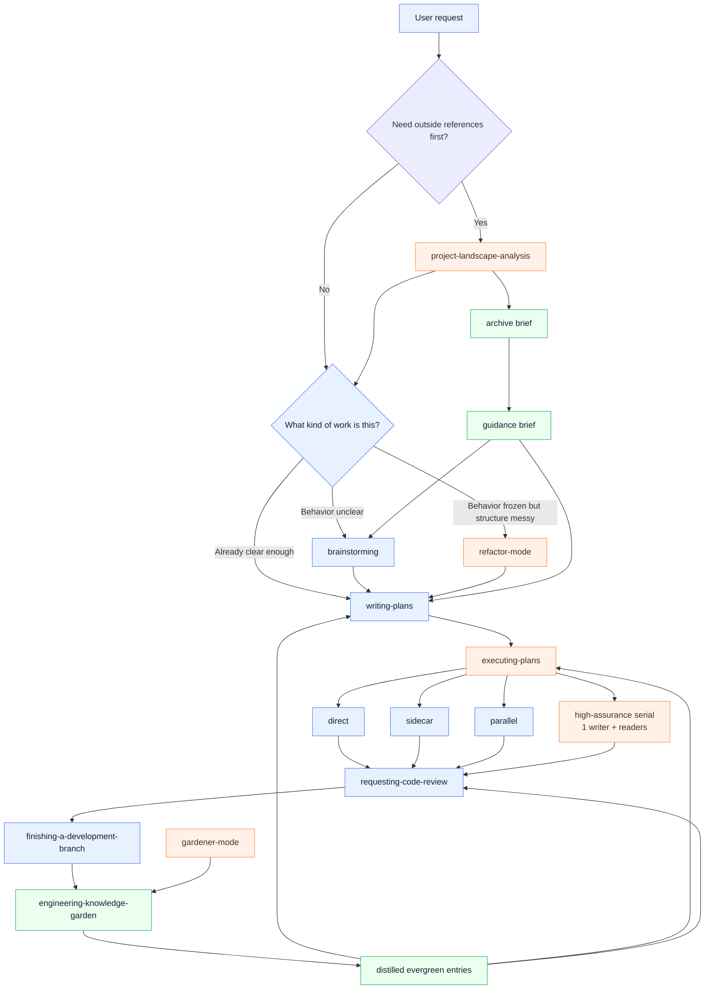
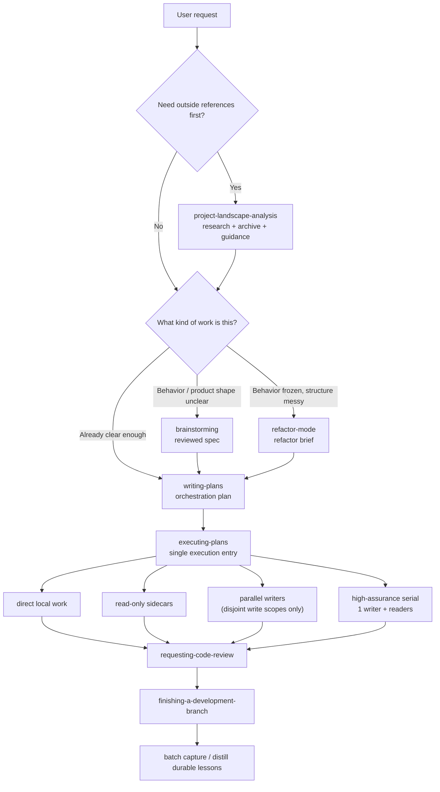
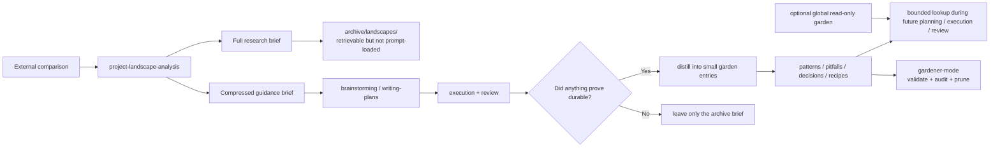

# better-sp (fork of Superpowers)

[English](./README.md) | [简体中文](./README.zh-CN.md)

`better-sp` is an experimental fork layer on top of [obra/superpowers](https://github.com/obra/superpowers), focused on fixing orchestration pain points we hit in real agent workflows:

- hard waiting after dispatch
- making the human choose internal execution modes
- shared write scope collapsing into idle single-thread work
- treating refactors like endless feature patching
- polluting `AGENTS.md` with project memory

This repository currently tracks those changes in a fork/worktree form rather than claiming upstream acceptance.

## Fork / Inspiration Notice

**Fork source**
- Upstream base: [obra/superpowers](https://github.com/obra/superpowers)

**Design references / inspirations**
- [xhyqaq/superpowers-plus](https://github.com/xhyqaq/superpowers-plus) — unified execution entry and lighter orchestration ergonomics
- Anthropic Claude Code memory / subagent patterns — for memory scoping and bounded context ideas
- Google Gemini CLI context / custom memory patterns — for progressive disclosure and project-vs-global context separation

**What this fork is trying to add**
- single execution entry via `executing-plans`
- no user-facing “pick an internal execution mode” handoff
- `shared write scope -> 1 writer + readers`
- `spec != plan`
- `project-landscape-analysis`
- `refactor-mode`
- `engineering-knowledge-garden`
- `gardener-mode`

## Additional Notes

- Custom skills and system notes:
  - `docs/better-sp-custom-skills-and-system.md`

## Specially Marked Workflow Map

Legend:
- **Blue**: upstream baseline skill / workflow node
- **Orange**: better-sp custom or materially strengthened node
- **Green**: knowledge-garden loop introduced in this fork



## Fork Architecture At A Glance



## Research -> Archive -> Distilled Garden Loop



## Live Sample Of The Loop

Real sample files in this branch:

- Archive brief:
  - `docs/engineering-knowledge-garden/archive/landscapes/2026-04-06-agent-workflow-landscape.md`
- Guidance brief:
  - `docs/engineering-knowledge-garden/guidance/2026-04-06-agent-workflow-landscape-guidance.md`
- Distilled entries:
  - `docs/engineering-knowledge-garden/decisions/keep-research-archives-separate-from-evergreen-garden-entries.md`
  - `docs/engineering-knowledge-garden/agent-optimizations/use-one-execution-entry-and-route-internally-by-task-metadata.md`

This sample demonstrates the intended boundary:
- full comparison stays in `archive/landscapes/`
- downstream only needs compressed guidance
- only durable lessons get promoted into evergreen entries

## Artifact Boundary

| Artifact | Purpose | Who it is for | Should it flow downstream? |
|---|---|---|---|
| Spec | human review artifact | human + controller | yes |
| Plan | orchestration artifact | controller + implementers | yes |
| Archive brief | full research / comparison record | human + later retrieval | **no**, only by file path |
| Guidance brief | compressed borrow / avoid summary | downstream design / planning | yes |
| Garden entry | small durable knowledge | future planning / execution / review | yes, bounded lookup only |

## How it works

It starts from the moment you fire up your coding agent. As soon as it sees that you're building something, it *doesn't* just jump into trying to write code. Instead, it steps back and asks you what you're really trying to do.

If the problem needs outside comparison first, `project-landscape-analysis` does bounded research, archives the full brief, and hands only a compressed guidance card forward. That creates a clean **research -> archive -> guidance** split instead of stuffing raw notes into the working prompt.

Once the target behavior is clear enough, `brainstorming` produces the **spec** — the human review artifact. If the behavior is already frozen and the real problem is structural cleanup, `refactor-mode` produces a **refactor brief** instead.

After that, `writing-plans` produces the **plan** — the orchestration artifact. The point is not just “what to build,” but also exact write scope, risk, routing, and verification so the controller can keep moving without asking the human to pick internal execution strategies.

Then `executing-plans` becomes the single execution entry. It routes tasks into direct work, read-only sidecars, safe parallel writers, or high-assurance serial execution. When the real write scope collapses, it should degrade to **1 writer + readers**, not “spawn one agent and wait.”

Finally, durable lessons get batched into the **engineering knowledge garden**. Full research stays archived. Only the parts that survived real implementation or review pressure become distilled evergreen entries.

There's a bunch more to it, but that's the core of the system. And because the skills trigger automatically, you don't need to do anything special. Your coding agent just has Superpowers.


## Sponsorship

If Superpowers has helped you do stuff that makes money and you are so inclined, I'd greatly appreciate it if you'd consider [sponsoring my opensource work](https://github.com/sponsors/obra).

Thanks!

- Jesse


## Installation

**Note:** Installation differs by platform. Claude Code or Cursor have built-in plugin marketplaces. Codex and OpenCode require manual setup.

### Claude Code Official Marketplace

Superpowers is available via the [official Claude plugin marketplace](https://claude.com/plugins/superpowers)

Install the plugin from Claude marketplace:

```bash
/plugin install superpowers@claude-plugins-official
```

### Claude Code (via Plugin Marketplace)

In Claude Code, register the marketplace first:

```bash
/plugin marketplace add obra/superpowers-marketplace
```

Then install the plugin from this marketplace:

```bash
/plugin install superpowers@superpowers-marketplace
```

### Cursor (via Plugin Marketplace)

In Cursor Agent chat, install from marketplace:

```text
/add-plugin superpowers
```

or search for "superpowers" in the plugin marketplace.

### Codex

Tell Codex:

```
Fetch and follow instructions from https://raw.githubusercontent.com/guhaigg/better-sp/refs/heads/main/.codex/INSTALL.md
```

**Detailed docs:** [docs/README.codex.md](docs/README.codex.md)

**Global activation note:** Codex native discovery should still mount this fork at `~/.agents/skills/superpowers` and point that symlink / junction at your `better-sp` `skills/` directory. Do **not** mount both `superpowers` and `better-sp` trees at the same time or you may get duplicate skills.

**Recommended live layout:** keep a stable clone such as `~/.codex/better-sp` as the global mount target. Use a worktree target only during active skill development, then switch the live mount back to the stable clone before normal daily use.

### OpenCode

Tell OpenCode:

```
Fetch and follow instructions from https://raw.githubusercontent.com/obra/superpowers/refs/heads/main/.opencode/INSTALL.md
```

**Detailed docs:** [docs/README.opencode.md](docs/README.opencode.md)

### GitHub Copilot CLI

```bash
copilot plugin marketplace add obra/superpowers-marketplace
copilot plugin install superpowers@superpowers-marketplace
```

### Gemini CLI

```bash
gemini extensions install https://github.com/obra/superpowers
```

To update:

```bash
gemini extensions update superpowers
```

### Verify Installation

Start a new session in your chosen platform and ask for something that should trigger a skill (for example, "help me plan this feature" or "let's debug this issue"). The agent should automatically invoke the relevant superpowers skill.

## What This Fork Changes

### Workflow changes

1. **project-landscape-analysis** - Activates when a greenfield project, new subsystem, or expensive architecture choice should first be compared against external references. It performs a bypass check, prefers secondary sources, archives the full brief, and passes only a compressed guidance card downstream.

2. **brainstorming** - Activates when behavior or feature shape is still unclear. It no longer tries to own every possible non-trivial task, and it should not force dead clarification loops once the spec is already sharp.

3. **refactor-mode** - Activates when behavior is mostly frozen but the code has become patchy, duplicated, or hard to reuse. Produces a refactor brief before structural cleanup.

4. **using-git-worktrees** - Activates after design or refactor approval. Creates isolated workspace on new branch, runs project setup, verifies clean test baseline.

5. **writing-plans** - Activates with approved spec or refactor brief. Produces the orchestration plan: bite-sized tasks with exact file paths, verification steps, write scope, conflict notes, routing recommendation, and review level.

6. **executing-plans** - Activates with plan. Acts as the single execution entry point and routes each task into direct execution, sidecar help, parallel dispatch, or high-assurance serial execution.

7. **test-driven-development** - Activates during implementation. Enforces RED-GREEN-REFACTOR: write failing test, watch it fail, write minimal code, watch it pass, commit. Deletes code written before tests.

8. **requesting-code-review** - Activates between tasks. Reviews against plan, reports issues by severity. Critical issues block progress.

9. **finishing-a-development-branch** - Activates when tasks complete. Verifies tests, presents options (merge/PR/keep/discard), cleans up worktree.

10. **engineering-knowledge-garden** - Activates when durable project knowledge should be looked up, archived from research, extracted into guidance artifacts, distilled into small evergreen entries, or pruned without polluting `AGENTS.md` or loading a giant memory blob.

11. **gardener-mode** - Activates as a separate maintenance workflow to validate, audit, distill archive backlog, and prune the knowledge garden without blocking everyday implementation.

**The agent checks for relevant skills before any task.** Mandatory workflows, not suggestions.

## Pressure-Tested Behaviors

This fork was explicitly pressure-tested against the orchestration failures that motivated it:

- no immediate spawn-then-wait controller behavior
- no human-facing choice among internal execution strategies
- shared write scope degrades to **1 writer + readers**
- refactor work gets its own workflow instead of becoming another feature patch pile

See:
- `docs/superpowers/evals/2026-04-06-better-sp-routing-pressure-test.md`
- `docs/superpowers/evals/2026-04-06-better-sp-workflow-regression-matrix.md`
- `docs/superpowers/specs/2026-04-06-engineering-knowledge-garden-design.md`

## Minimal CI / Fork Status Check

This fork now includes a minimal GitHub Actions workflow for fork maintenance:

- workflow file: `.github/workflows/ci.yml`
- intended required status check: `CI / integrity`
- coverage:
  - `tests/engineering-knowledge-garden/garden-cli.test.js`
  - `tests/workflow-evals/workflow-contracts.test.js`
  - `node skills/engineering-knowledge-garden/scripts/garden.cjs validate docs/engineering-knowledge-garden --include-archive`
  - `git diff --check`

The goal is not heavyweight automation. It is a cheap regression layer that catches accidental workflow / garden contract drift before merge.

## What's Inside

### Skills Library

**Testing**
- **test-driven-development** - RED-GREEN-REFACTOR cycle (includes testing anti-patterns reference)

**Debugging**
- **systematic-debugging** - 4-phase root cause process (includes root-cause-tracing, defense-in-depth, condition-based-waiting techniques)
- **verification-before-completion** - Ensure it's actually fixed

**Collaboration**
- **brainstorming** - Socratic design refinement
- **writing-plans** - Detailed implementation plans
- **executing-plans** - Single execution entry point with task routing
- **requesting-code-review** - Pre-review checklist
- **receiving-code-review** - Responding to feedback
- **using-git-worktrees** - Parallel development branches
- **finishing-a-development-branch** - Merge/PR decision workflow
- **subagent-driven-development** - High-assurance single-writer strategy for shared-write or high-risk tasks
- **dispatching-parallel-agents** - Parallel writer/reader strategy for disjoint work or single-writer + sidecars
- **refactor-mode** - Behavior-freeze and seam-migration workflow for structural cleanup
- **project-landscape-analysis** - Bounded external comparison with bypass, source ladder, and compressed handoff
- **engineering-knowledge-garden** - Searchable project intelligence with local write roots, optional global read-only lookup, and validated entries
- **gardener-mode** - Scheduled / explicit maintenance workflow for validating and pruning the knowledge garden

**Meta**
- **writing-skills** - Create new skills following best practices (includes testing methodology)
- **using-superpowers** - Introduction to the skills system

## Philosophy

- **Test-Driven Development** - Write tests first, always
- **Systematic over ad-hoc** - Process over guessing
- **Complexity reduction** - Simplicity as primary goal
- **Evidence over claims** - Verify before declaring success

Read more: [Superpowers for Claude Code](https://blog.fsck.com/2025/10/09/superpowers/)

## Contributing

Skills live directly in this repository. To contribute:

1. Fork the repository
2. Create a branch for your skill
3. Follow the `writing-skills` skill for creating and testing new skills
4. Submit a PR

See `skills/writing-skills/SKILL.md` for the complete guide.

## Repository Notes

- This branch/worktree is based on `obra/superpowers`
- This fork is intended to be uploaded as a fork or derivative repo with explicit attribution
- If you plan to upstream pieces of it later, split the changes into small evidence-backed PRs rather than one giant fork dump

## Updating

Skills update automatically when you update the plugin:

```bash
/plugin update superpowers
```

## License

MIT License - see LICENSE file for details

## Community

Superpowers is built by [Jesse Vincent](https://blog.fsck.com) and the rest of the folks at [Prime Radiant](https://primeradiant.com).

- **Discord**: [Join us](https://discord.gg/Jd8Vphy9jq) for community support, questions, and sharing what you're building with Superpowers
- **Issues**: https://github.com/obra/superpowers/issues
- **Release announcements**: [Sign up](https://primeradiant.com/superpowers/) to get notified about new versions
