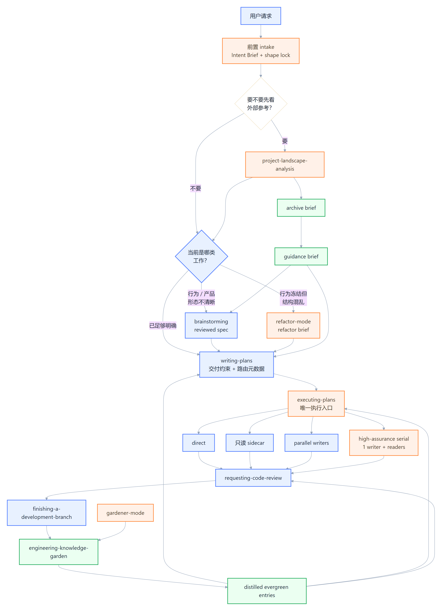
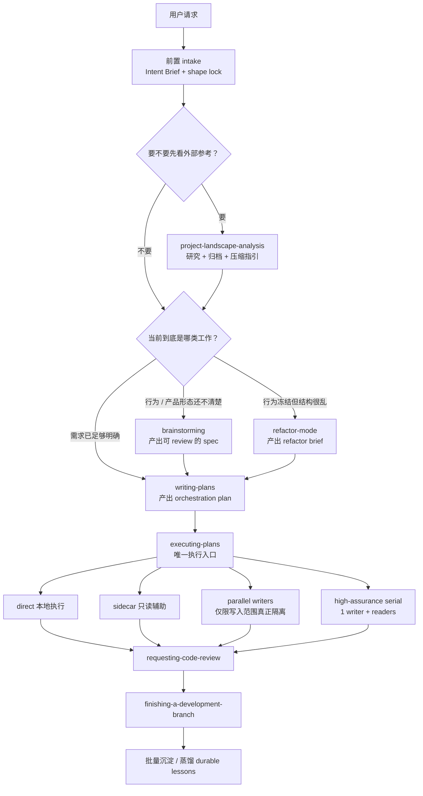
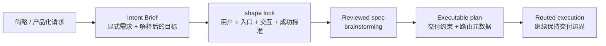
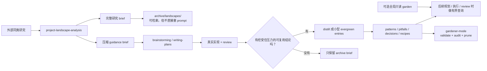

# better-sp（Superpowers 的改良分叉）

[English](./README.md) | [简体中文](./README.zh-CN.md)

`better-sp` 是基于 [obra/superpowers](https://github.com/obra/superpowers) 的实验性分叉，目标不是“重写一套技能文档”，而是修正我们在真实 agent 开发里反复遇到的几个编排问题：

- 主代理分配完子代理就硬等
- 让人类去选内部执行模式
- 共享写入范围一出现就把并行退化成空等
- refactor 被当成“继续打 feature patch”
- 项目记忆全塞进 `AGENTS.md`

这个仓库当前是一个 **fork / worktree 形态的实验层**，不是在宣称这些修改已经被 upstream 接受。

## Fork / 借鉴说明

**Fork 来源**
- 上游基线：[obra/superpowers](https://github.com/obra/superpowers)

**设计借鉴 / 灵感来源**
- [xhyqaq/superpowers-plus](https://github.com/xhyqaq/superpowers-plus) —— 单一执行入口与更轻量的编排体验
- Anthropic Claude Code 的 memory / subagent 模式 —— 记忆分层与有界上下文
- Google Gemini CLI 的 context / custom memory 模式 —— 渐进式披露与全局 / 项目分离

## 这个分叉想补什么

- `Intent Brief + deliverable-shape lock` 这一层前置收口
- 把锁定的交付边界一路带进 planning / execution
- `executing-plans` 作为**单一执行入口**
- 不再把“选内部执行模式”甩给用户
- `shared write scope -> 1 writer + readers`
- `spec != plan`
- `project-landscape-analysis`
- `refactor-mode`
- `engineering-knowledge-garden`
- `gardener-mode`

## 补充说明

- 自定义 skill 与体系说明（含必要提醒）：
  - `docs/better-sp-custom-skills-and-system.zh-CN.md`

## 特殊标注版流程图

图例：
- **蓝色**：upstream 已有的基线 skill / 流程节点
- **橙色**：better-sp 强化或新增的关键节点
- **绿色**：我们新增的知识沉淀闭环

- 可编辑 Figma：<https://www.figma.com/online-whiteboard/create-diagram/49b8e383-5e08-4494-bd47-d090a5210e96?utm_source=other&utm_content=edit_in_figjam&oai_id=&request_id=7261b542-a62b-4885-aa0a-5334f5240591>
- 本地 PNG：`docs/assets/better-sp-workflow-map.zh-CN.png`
- 图源：`docs/assets/better-sp-workflow-map.zh-CN.mmd`

**说明：** 这里的“前置 intake”还不是一个独立发布出来的新 skill。在当前分支里，它主要体现为：
- `brainstorming` 先做 `Intent Brief + shape lock`
- `writing-plans` 把锁定的交付约束写进 plan
- `executing-plans` 在路由执行时继续保持这个交付边界

## 工作流总览

## 前置层与交付边界

这个分支现在更明确地把“简略但产品化”的请求先收口，再进入 planning / execution。核心目标是：**扩写用户简略表达，而不是偷换交付物。**

落到实际 skill 上就是：
- `brainstorming` 不该把页面 / 中心 / 一键修复静默降级成内部脚本或 CLI
- `writing-plans` 需要把 shape、primary user、entry surface、downgrade warning 写进 plan header
- `executing-plans` 负责内部路由，但**不能**借路由之名重解释已经确认过的目标

## Research -> Archive -> Distilled Garden 闭环

## 闭环活样本

当前分支里已经有一份真实样本：

- Archive brief：
  - `docs/engineering-knowledge-garden/archive/landscapes/2026-04-06-agent-workflow-landscape.md`
- Guidance brief：
  - `docs/engineering-knowledge-garden/guidance/2026-04-06-agent-workflow-landscape-guidance.md`
- Distilled entries：
  - `docs/engineering-knowledge-garden/decisions/keep-research-archives-separate-from-evergreen-garden-entries.md`
  - `docs/engineering-knowledge-garden/agent-optimizations/use-one-execution-entry-and-route-internally-by-task-metadata.md`

这个样本体现的边界是：
- 完整对比留在 archive
- 下游只吃压缩 guidance
- 真正经受住实现 / review 压力的结论，再提升成 evergreen entry

## Artifact 边界

| Artifact | 作用 | 给谁看 | 是否应该继续往下游传 |
|---|---|---|---|
| Spec | 人类 review 工件 | 人类 + controller | 是 |
| Plan | orchestration 工件 | controller + implementer | 是 |
| Archive brief | 完整研究 / 对比记录 | 人类 + 后续检索 | **否**，只传文件路径 |
| Guidance brief | Borrow / Avoid 压缩摘要 | 下游设计 / 规划 | 是 |
| Garden entry | 小而耐用的工程知识 | 后续规划 / 执行 / review | 是，但必须有界加载 |

## 它和原版相比，核心差异是什么

### 1. 多了一层“Intent Brief + 交付形态锁定”

对于简略但明显带产品形态的请求，better-sp 现在更强调：
- 先扩写用户表达
- 再锁定交付形态
- 然后才进入 spec / plan

也就是先问清：
- 这是给谁的
- 从哪里进入
- 交互形态是什么
- 什么才算真正完成

而不是直接挑一个最容易实现的内部形态。

### 2. 不再默认“派一个子代理然后硬等”

`executing-plans` 不应该把子代理当成用户可见模式，而应该把它当成**内部路由策略**。

目标行为：
- 有本地可做的 controller 工作，就先做
- 有只读 sidecar 能并行，就先并行
- 只有真正阻塞时才等待

### 3. 共享写入范围时，不是假并行，而是 **1 writer + readers**

一旦真实写入范围收敛到同一组文件：
- 不再继续多 writer 乱写
- 也不该让 controller 直接空等
- 正确退化方式是：**单 writer + 只读 explorer / verifier / reviewer**

### 4. `spec` 和 `plan` 明确分离

- **spec**：给人 review，用来确认“要做什么”
- **plan**：给 agent 编排，用来确认“怎么拆、谁能并行、哪儿会冲突、如何验证”

### 5. `refactor-mode` 把“结构收口”从 feature patch 流里拆出来

refactor 不是“继续写功能，只是顺手清理一下”。

它需要先冻结行为，再产出：
- Frozen Behavior
- Target Shape
- Seam Map
- Migration Order
- Temporary Scaffolding

### 6. `engineering-knowledge-garden` 负责项目记忆，别再污染 `AGENTS.md`

项目知识应该：
- 小
- 可检索
- 有触发条件
- 有证据
- 可以验证

而不是把所有东西都塞进一个永远越长越乱的 `AGENTS.md`。

## 这版新增 / 强化的知识花园能力

- 支持 **archive-create**：先把完整研究 brief 归档
- 支持 **search-archive**：回查历史研究，而不是重新联网再搜一遍
- 支持 **extract-guidance**：把 archive 里的 `Downstream Guidance` 半自动压缩成可传下游的 guidance artifact
- 支持 **distill**：把 archive 中真正耐用的结论蒸馏成 evergreen entry
- `audit` 会额外检查 **archive backlog**
- `validate --include-archive` 可以同时校验 archive / guidance / evergreen entry 结构

## 主要技能变化

1. **project-landscape-analysis**  
   先做 bypass check；优先二手分析而不是直接啃 repo；完整研究进入 archive，再抽 guidance brief 传下游。

2. **brainstorming**  
   先做 `Intent Brief + shape lock`，只在真的需要澄清行为时问问题，不再为了“显得严谨”强行问题循环。

3. **refactor-mode**  
   行为冻结 + 结构收口的独立入口。

4. **writing-plans**  
   plan 是 orchestration artifact，要写清 write scope、冲突、验证、路由建议、Knowledge Inputs，以及锁定的交付约束。

5. **executing-plans**  
   单一执行入口；内部决定 direct / sidecar / parallel / high-assurance-serial，并在执行中继续保持锁定的交付边界。

6. **engineering-knowledge-garden**  
   负责 lookup / archive / guidance / distill / capture / prune。

7. **gardener-mode**  
   独立维护模式；负责 validate、audit、archive backlog 收口、重复项与陈旧项治理。

## 压测过的行为

这版 fork 明确围绕这些失败模式做过 pressure test：

- 不再默认 spawn 一个子代理就 wait
- 不再让人类选择内部执行模式
- shared write scope 会退化成 **1 writer + readers**
- refactor 不再被混进 feature patch 流

参考：
- `docs/superpowers/evals/2026-04-06-better-sp-routing-pressure-test.md`
- `docs/superpowers/evals/2026-04-06-better-sp-workflow-regression-matrix.md`
- `docs/superpowers/specs/2026-04-06-engineering-knowledge-garden-design.md`

## 最小 CI / 状态检查

这个 fork 现在补了一层最小 GitHub Actions CI：

- 工作流文件：`.github/workflows/ci.yml`
- 目标 required status check：`CI / integrity`
- 覆盖内容：
  - `tests/engineering-knowledge-garden/garden-cli.test.js`
  - `tests/workflow-evals/workflow-contracts.test.js`
  - `node skills/engineering-knowledge-garden/scripts/garden.cjs validate docs/engineering-knowledge-garden --include-archive`
  - `git diff --check`

目标不是把 fork 变成重型流水线，而是给 workflow / garden contract 一层便宜但有用的回归保护。

## 当前继续强化的方向

这个分支现在已经更擅长守住“产品形态别跑偏”，但下一个明显要继续补强的方向是：

- **当前更强的部分：** 简略请求的前置收口、交付形态锁定、以及 execution routing 时继续保持交付边界
- **下一步要补的部分：** 对 patch / bridge / restart / self-mutation / old variant upgrade 这类集成敏感任务，把 runtime contract 写得更硬、更早

也就是说，下一步不是把内部模式重新暴露给用户，而是把实现层收口做得更扎实。

## 安装

安装方式仍然沿用 Superpowers 原有平台分发方式，但 **Codex 的全局挂载建议直接复用 `~/.agents/skills/superpowers` 这个入口名**，把它指到 `better-sp` 的 `skills/` 目录。

- Claude Code / Cursor：插件市场
- Codex：看 `docs/README.codex.md`
- OpenCode：看 `docs/README.opencode.md`
- Gemini CLI：扩展安装

Codex 下的关键点是：
- 全局生效不是改 `config.toml`
- 而是让 `~/.agents/skills/superpowers` 这个 symlink / junction 指向你的 `better-sp/skills`
- 然后 **重启 Codex**
- **不要同时再挂一个 `better-sp` 入口**，否则可能出现重复发现同名技能

推荐的长期形态是：
- 用稳定 clone，例如 `~/.codex/better-sp` 作为全局技能源
- `~/.agents/skills/superpowers` 始终只指向这一套稳定 `skills/`
- worktree 只在你主动开发 / 调试 skill 时临时挂载
- 验证完再切回稳定 clone

如果你之前一直在用原版 `~/.codex/superpowers`，正确迁移顺序是：
1. 先准备好 `~/.codex/better-sp`
2. 再把 `~/.agents/skills/superpowers` 改指到 `~/.codex/better-sp/skills`
3. 重启 Codex
4. 最后再删除旧的 `~/.codex/superpowers`

不要在仍有 worktree 依赖旧仓库 `.git` 元数据时先删旧仓库。

平台细节请优先看英文 README 与对应安装文档。

## 仓库说明

- 这个分支 / worktree 基于 `obra/superpowers`
- 目标是先把真实痛点修顺，再考虑是否拆分出可 upstream 的小 PR
- 如果后面要往 upstream 回推，应该拆成**小而有证据**的 PR，而不是一坨“大 fork dump”

## License

MIT License - see `LICENSE`
