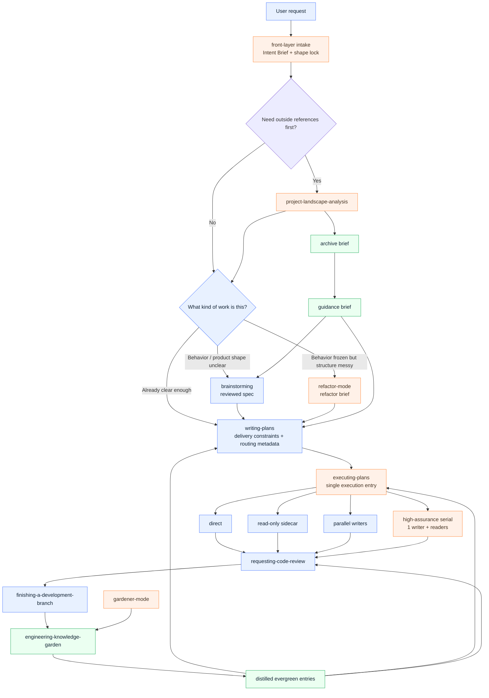
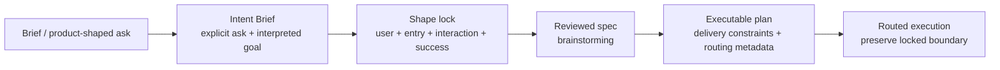

# better-sp: Custom Skills and System Notes

This document explains the **fork-specific additions and workflow changes** in better-sp relative to upstream superpowers, plus the cautionary notes that should travel with them.

## First: this is not a clean-room replacement

better-sp is **not** an attempt to erase or supersede [obra/superpowers](https://github.com/obra/superpowers).

It is:

- built on top of upstream superpowers
- shaped by pain points observed in real agent sessions
- adding a small number of workflow skills and routing conventions
- tightening artifact boundaries around spec / plan / archive / memory

The right description is:

> **a fork-specific workflow layer on top of upstream superpowers**

not:

> “a completely separate system with no upstream dependency”

## What this fork is trying to fix

The changes in better-sp are mostly aimed at these failures:

1. the controller dispatches a subagent and then hard-waits
2. humans are asked to choose internal execution modes
3. shared write scope collapses into fake parallelism or idle waiting instead of **1 writer + readers**
4. refactors get treated like endless feature patching
5. project memory gets dumped into `AGENTS.md` until it becomes a context landfill

## Specially Marked Workflow Map

Legend:

- **Blue** = upstream baseline workflow / existing core skill
- **Orange** = better-sp custom or materially strengthened workflow node
- **Green** = knowledge-garden loop introduced in this fork

**Note:** the front-layer intake is not a separate published skill yet. In this branch it is mainly expressed through:
- `brainstorming` starting with `Intent Brief + shape lock`
- `writing-plans` preserving locked delivery constraints
- `executing-plans` preserving the locked delivery boundary during routing

## Front Layer And Delivery Boundary

One of the most important hardenings in this branch is that brief product-shaped asks should be expanded before planning or execution, not silently mutated into a smaller internal deliverable.

## The main custom / strengthened skills

### 1. `project-landscape-analysis`

Purpose:
- compare adjacent projects or architectural approaches **before** locking a design

What is different here:
- starts with a bypass check
- prefers human-written teardowns and summaries before repo spelunking
- explicitly separates:
  - **full archive brief**
  - **compressed guidance brief**

Required caution:
- it is not “search a few repos and invent a comparison matrix”
- downstream implementation should not receive the full research brief by default
- unsupported dimensions should remain `unknown`

---

### 2. `refactor-mode`

Purpose:
- treat structural cleanup as its own workflow instead of “feature work but cleaner”

What is different here:
- behavior is frozen first
- output is a **refactor brief**, not immediate coding

Required caution:
- if the target behavior is still moving, this is not a refactor yet
- temporary adapters / scaffolding must have an explicit removal trigger

---

### 3. `executing-plans`

Purpose:
- become the **single human-facing execution entry**

What is different here:
- the controller should route internally from task metadata
- humans should not be asked to pick among internal scheduler modes

Required caution:
- this is an internal router, not a user menu
- if runtime write scope contradicts the original plan, re-route
- do not default to immediate waiting while useful controller work still exists
- routing is not permission to shrink the locked deliverable boundary

---

### 4. `engineering-knowledge-garden`

Purpose:
- replace indiscriminate `AGENTS.md` memory dumping with a structured, searchable project intelligence layer

What is different here:
- it distinguishes:
  - **archive brief**
  - **guidance brief**
  - **evergreen garden entry**
- it supports:
  - lookup
  - archive
  - distill
  - capture
  - prune

Required caution:
- archive is not evergreen memory
- raw notes are not evergreen memory
- transcripts are not evergreen memory
- only conclusions that survived implementation or review pressure should be distilled

---

### 5. `gardener-mode`

Purpose:
- maintain the garden outside the hot path of feature work

What is different here:
- pruning, archive backlog review, and distillation are treated as maintenance work

Required caution:
- this workflow should reduce entropy, not create invisible churn
- avoid blind bulk rewrites
- prefer reviewable diffs

## The key boundaries in this system

### Boundary 1: `spec != plan`

- **spec** is for human review
- **plan** is for orchestration and task routing

Required caution:
- do not overload the spec with scheduler detail
- do not hide product / behavior uncertainty inside the plan

---

### Boundary 2: `archive != guidance != evergreen`

- **archive** = full research, context, comparison, long-form notes
- **guidance** = compressed downstream borrow / avoid handoff
- **evergreen** = small, reusable, triggerable knowledge

Required caution:
- something being interesting is not enough to promote it
- do not hand the full archive to downstream skills when a guidance brief is enough
- archive first, distill later

---

### Boundary 3: `human-facing choice != internal routing choice`

Humans should decide:
- whether to do the work
- what success looks like
- what risks are acceptable

Humans should **not** usually be asked to decide:
- which internal execution strategy to use
- when the controller should wait
- which internal review routing path to choose

Required caution:
- do not offload controller uncertainty onto the human

---

### Boundary 4: `parallel != multiple writers by default`

Parallelism only means multiple writers when write scope is truly disjoint.

Required caution:
- once shared write scope is discovered, degrade to:
  - **1 writer + readers**
- do not keep multiple writers on the same file family
- do not turn shared-write discovery into idle waiting

## Required warnings

### 1. These fork-specific skills are not upstream defaults

If parts of better-sp are later proposed upstream:
- do not submit the fork as one giant dump
- split changes into small PRs
- attach evidence to each change

### 2. Skill text is behavioral code, not harmless prose

That means:
- wording changes are not “just polishing”
- flowchart changes are not “just presentation”
- changing red-flag tables or rationalization counters can materially change agent behavior

### 3. Behavioral changes without pressure testing should not be sold as improvements

Especially for:
- routing
- review gates
- subagent handoff
- memory / lookup / capture

Preferred evidence:
- baseline failure
- updated behavior after the change
- ideally a transcript or eval artifact
- cheap regression coverage in CI when full transcript harnesses are too heavy

### 4. Do not turn `AGENTS.md` into a landfill again

`AGENTS.md` should stay limited to:
- short rules
- entry-point pointers
- highest-priority constraints

Do not use it as a sink for:
- long-form memory
- research notes
- process logs
- project trivia

### 5. Do not add workflow cost just to look rigorous

Common anti-patterns:
- endless questioning after the spec is already clear
- injecting full archive briefs into downstream prompts
- continuing multi-writer work after shared write scope is obvious
- continuing feature patch flow when the real job is structural consolidation

## How this fork should be maintained

The healthiest framing is:

> better-sp is an **experimental workflow fork plus evidence-driven orchestration layer**

not:

> “a finished replacement standard that should casually overwrite upstream philosophy”

## The principles most worth keeping

1. **prove the problem before changing the skill**
2. **separate artifacts before passing context**
3. **bound write scope before talking about parallelism**
4. **archive first, distill later**
5. **lead with evidence before calling something an optimization**

## Recommended external description

If you need to explain this fork publicly, a safer description is:

> better-sp is a fork of superpowers focused on orchestration ergonomics, refactor workflow, external-reference intake, and an engineering knowledge garden. It does not try to replace all upstream philosophy; it packages the workflow and memory adjustments that proved useful in our real agent sessions into a more explicit layer.
