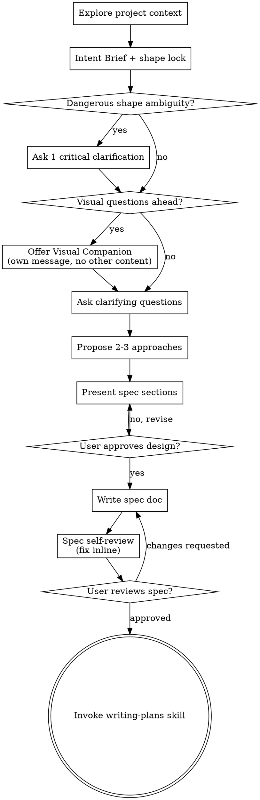

# Brainstorming Ideas Into Specs

Help turn ideas into a reviewed **spec** through natural collaborative dialogue. The output of this skill is a human-review artifact, not an execution plan.

Start by understanding the current project context, then ask questions only as needed to refine the idea. Once you understand what you're building, present the proposed spec and get user approval.

<HARD-GATE>
Once you are using brainstorming, do NOT invoke any implementation skill, write any code, scaffold any project, or take any implementation action until you have presented a spec and the user has approved it. Do not force brainstorming onto pure structure-only cleanup that belongs in `superpowers:refactor-mode`.
</HARD-GATE>

## Front-Layer Gate: Intent Before Spec

Before you brainstorm architecture or implementation shape, first normalize the user's shorthand into a lightweight **Intent Brief**.

This is especially important when the request contains product-shaped language such as:
- page / feature / center / panel / settings / entry / one-click / workflow / experience
- or brief requests like “做个中心 / 加个功能页 / 顺一下体验 / 支持一下修复”

Your first job is **not** to guess the easiest implementation. Your first job is to understand what the user is actually asking to ship.

**Core rule:** expand the shorthand, do not mutate the target.

If a wrong guess would change the deliverable shape, primary user, entry surface, or success criteria, do not silently decide it.

## When Brainstorming Is The Right Tool

Use this skill when:
- the user wants a new feature or behavior change, but the shape is still fuzzy
- success criteria, constraints, or trade-offs are not yet crisp
- multiple approaches are plausible and should be compared before coding

Don't use this skill when:
- the user asked for external comparison or similar-project research first → use `superpowers:project-landscape-analysis`
- the work is a **behavior-frozen structural cleanup** → use `superpowers:refactor-mode`
- the spec is already approved and you just need execution planning → use `superpowers:writing-plans`
- the task is a tiny tactical fix with no meaningful design ambiguity

## Anti-Pattern: "Force Questions Even When The Spec Is Already Clear"

The point is not to maximize questions. The point is to remove material ambiguity before implementation.

If the user already gave enough detail to draft a spec:
- confirm the sharp edges briefly
- present a draft spec early
- only ask follow-up questions where the answer would materially change architecture, scope, verification, or UX

A short spec is fine. A dead question loop is not. “Simple” still is not permission to skip the spec entirely.

## Checklist

You MUST create a task for each of these items and complete them in order:

1. **Explore project context** — check files, docs, recent commits
2. **Normalize intent** — produce a lightweight Intent Brief: explicit ask, interpreted goal, deliverable shape, primary user, entry surface, success criteria, dangerous ambiguities
3. **Lock deliverable shape** — if the shape is still dangerous to guess, ask one critical clarification question before broader spec work
4. **Offer visual companion** (if topic will involve visual questions) — this is its own message, not combined with a clarifying question. See the Visual Companion section below.
5. **Ask clarifying questions** — one at a time, but only while material ambiguity remains
6. **Propose 2-3 approaches** — with trade-offs and your recommendation
7. **Present spec** — in sections scaled to their complexity, get user approval after each section
8. **Write spec doc** — save to `docs/superpowers/specs/YYYY-MM-DD-<topic>-design.md` and commit
9. **Spec self-review** — quick inline check for placeholders, contradictions, ambiguity, scope (see below)
10. **User reviews written spec** — ask user to review the spec file before proceeding
11. **Transition to implementation** — invoke writing-plans skill to create implementation plan

## Process Flow

**The terminal state is invoking writing-plans.** Do NOT invoke frontend-design, mcp-builder, or any other implementation skill. The ONLY skill you invoke after brainstorming is writing-plans.

**Artifact boundary:** brainstorming writes the **spec** for human review; `writing-plans` later derives the **plan** for orchestration.

## The Process

**Understanding the idea:**

- Check out the current project state first (files, docs, recent commits)
- Before broader spec work, normalize the user's shorthand into a brief understanding of:
  - what they explicitly asked for
  - what you think they intend to ship
  - the likely deliverable shape
  - the primary user
  - the likely entry surface
  - the success criteria
- Before asking detailed questions, assess scope: if the request describes multiple independent subsystems (e.g., "build a platform with chat, file storage, billing, and analytics"), flag this immediately. Don't spend questions refining details of a project that needs to be decomposed first.
- If the project is too large for a single spec, help the user decompose into sub-projects: what are the independent pieces, how do they relate, what order should they be built? Then brainstorm the first sub-project through the normal design flow. Each sub-project gets its own spec → plan → implementation cycle.
- If the request is product-shaped but brief, do **not** silently reinterpret it into the easiest internal tool, script, or CLI. Feature/page/center/entry requests are not equivalent to tooling unless the user explicitly accepts that downgrade.
- If the user already supplied clear purpose, constraints, and success criteria, move quickly to a draft spec instead of forcing a long question phase
- For appropriately-scoped projects that are still unclear, ask questions one at a time to refine the idea
- Prefer multiple choice questions when possible, but open-ended is fine too
- Only one question per message - if a topic needs more exploration, break it into multiple questions
- Focus on understanding: purpose, constraints, success criteria
- If you need clarification, prefer the **one critical question** that decides deliverable shape or success criteria over several lower-value questions.

**Exploring approaches:**

- Propose 2-3 different approaches with trade-offs
- Present options conversationally with your recommendation and reasoning
- Lead with your recommended option and explain why

**Presenting the spec:**

- Once you believe you understand what you're building, present the spec
- Scale each section to its complexity: a few sentences if straightforward, up to 200-300 words if nuanced
- Ask after each section whether it looks right so far
- Cover: architecture, components, data flow, error handling, testing
- Be ready to go back and clarify if something doesn't make sense

**Design for isolation and clarity:**

- Break the system into smaller units that each have one clear purpose, communicate through well-defined interfaces, and can be understood and tested independently
- For each unit, you should be able to answer: what does it do, how do you use it, and what does it depend on?
- Can someone understand what a unit does without reading its internals? Can you change the internals without breaking consumers? If not, the boundaries need work.
- Smaller, well-bounded units are also easier for you to work with - you reason better about code you can hold in context at once, and your edits are more reliable when files are focused. When a file grows large, that's often a signal that it's doing too much.

**Working in existing codebases:**

- Explore the current structure before proposing changes. Follow existing patterns.
- Where existing code has problems that affect the work (e.g., a file that's grown too large, unclear boundaries, tangled responsibilities), include targeted improvements as part of the design - the way a good developer improves code they're working in.
- Don't propose unrelated refactoring. Stay focused on what serves the current goal.

## After the Spec

**Documentation (spec artifact):**

- Write the validated spec to `docs/superpowers/specs/YYYY-MM-DD-<topic>-design.md`
  - (User preferences for spec location override this default)
- Use elements-of-style:writing-clearly-and-concisely skill if available
- Commit the spec document to git

**Spec Self-Review:**
After writing the spec document, look at it with fresh eyes:

1. **Placeholder scan:** Any "TBD", "TODO", incomplete sections, or vague requirements? Fix them.
2. **Internal consistency:** Do any sections contradict each other? Does the architecture match the feature descriptions?
3. **Scope check:** Is this focused enough for a single implementation plan, or does it need decomposition?
4. **Ambiguity check:** Could any requirement be interpreted two different ways? If so, pick one and make it explicit.
5. **Deliverable-shape check:** Did you preserve the user's intended shape, user, entry surface, and success criteria — or did you silently shrink it into a tool/script/CLI?

Fix any issues inline. No need to re-review — just fix and move on.

**User Review Gate:**
After the spec review loop passes, ask the user to review the written spec before proceeding:

> "Spec written and committed to `<path>`. Please review it and let me know if you want to make any changes before we start writing out the implementation plan."

Wait for the user's response. If they request changes, make them and re-run the spec review loop. Only proceed once the user approves.

**Implementation handoff:**

- Invoke the writing-plans skill to create the orchestration plan from the approved spec
- Do NOT invoke any other skill. writing-plans is the next step.

## Key Principles

- **One question at a time** - Don't overwhelm with multiple questions
- **Multiple choice preferred** - Easier to answer than open-ended when possible
- **YAGNI ruthlessly** - Remove unnecessary features from all designs
- **Explore alternatives** - Always propose 2-3 approaches before settling
- **Incremental validation** - Present design, get approval before moving on
- **Be flexible** - Go back and clarify when something doesn't make sense

## Visual Companion

A browser-based companion for showing mockups, diagrams, and visual options during brainstorming. Available as a tool — not a mode. Accepting the companion means it's available for questions that benefit from visual treatment; it does NOT mean every question goes through the browser.

**Offering the companion:** When you anticipate that upcoming questions will involve visual content (mockups, layouts, diagrams), offer it once for consent:
> "Some of what we're working on might be easier to explain if I can show it to you in a web browser. I can put together mockups, diagrams, comparisons, and other visuals as we go. This feature is still new and can be token-intensive. Want to try it? (Requires opening a local URL)"

**This offer MUST be its own message.** Do not combine it with clarifying questions, context summaries, or any other content. The message should contain ONLY the offer above and nothing else. Wait for the user's response before continuing. If they decline, proceed with text-only brainstorming.

**Per-question decision:** Even after the user accepts, decide FOR EACH QUESTION whether to use the browser or the terminal. The test: **would the user understand this better by seeing it than reading it?**

- **Use the browser** for content that IS visual — mockups, wireframes, layout comparisons, architecture diagrams, side-by-side visual designs
- **Use the terminal** for content that is text — requirements questions, conceptual choices, tradeoff lists, A/B/C/D text options, scope decisions

A question about a UI topic is not automatically a visual question. "What does personality mean in this context?" is a conceptual question — use the terminal. "Which wizard layout works better?" is a visual question — use the browser.

If they agree to the companion, read the detailed guide before proceeding:
`skills/brainstorming/visual-companion.md`
