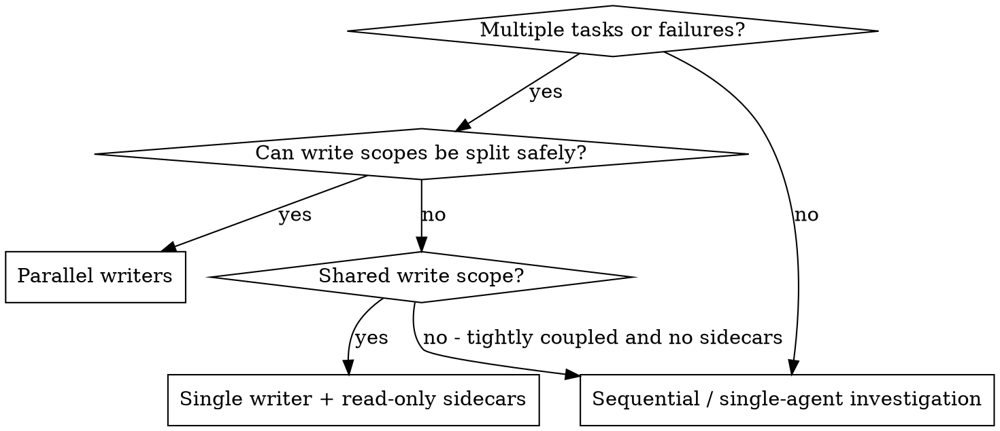

# Dispatching Parallel Agents

Delegate independent work to specialized agents with isolated context. Parallelism is not limited to “many writers”; it also includes **one writer plus read-only sidecars**.

**Core principle:** Dispatch one agent per independent domain, and if write scopes collide, degrade to **single writer + parallel readers**, not **single writer + waiting**.

## When to Use

**Use when:**
- 2+ independent failures have different likely root causes
- Multiple subsystems can be worked on without shared write scope
- One writer is active, but explorers / verifiers / bounded reviewers can still run in parallel

**Don't use when:**
- Failures are strongly coupled and require the same write scope
- Every useful next step depends on one unresolved blocking result

## Expected Inputs from writing-plans

When used to execute plan tasks, prefer task metadata from `superpowers:writing-plans` over ad-hoc judgment:
- `Depends on`
- `Write Scope`
- `Potential Conflicts`
- `Verify`
- `Execution Recommendation`
- `Review Level`

The key routing question is simple: are the write scopes actually disjoint? If not, keep one writer and preserve read-only parallelism.

## The Pattern

### 1. Identify Work Types

Split work into:
- **writer tasks** — code changes in a bounded write scope
- **reader tasks** — exploration, verification, bounded review, test runs, log analysis

### 2. Prefer Parallel Writers When Safe

If write scopes do not overlap:
- Agent A → subsystem 1
- Agent B → subsystem 2
- Agent C → subsystem 3

### 3. Degrade Gracefully on Shared Write Scope

If multiple tasks converge on the same file or module:
- keep **one writer**
- add read-only sidecars such as:
  - explorer → trace anchors / call sites / dependencies
  - verifier → run unaffected tests
  - reviewer → inspect bounded diff against checklist
  - analyst → summarize logs / regressions

**Shared write scope is not a reason to stop parallelism.**

### 4. The Controller Must Stay Busy

After dispatching agents:
- do not immediately wait
- finish non-blocking controller work first
- only wait when the next real step depends on a result and no sidecar work remains

## Agent Prompt Structure

Good prompts are:
1. **Focused** — one domain or one read-only purpose
2. **Bounded** — explicit files / tests / checklist / exclusions
3. **Specific about output** — root cause, changes, or verification result

## Common Mistakes

**❌ Too broad:** "Fix all the tests"
**✅ Better:** "Investigate failures in file X only"

**❌ Shared write scope => stop all parallel work**
**✅ Better:** keep one writer and add read-only sidecars

**❌ Spawn agents and immediately wait**
**✅ Better:** run local checks, prep integration, or dispatch sidecars first

**❌ Two writers editing same file family**
**✅ Better:** one writer, others stay read-only

## Verification

After agents return:
1. Review each summary
2. Check write-scope conflicts
3. Integrate or redirect follow-up work
4. Run relevant local verification

## Real-World Impact

Parallel dispatch is fastest when the controller keeps routing work instead of blocking. The biggest win is not “more agents”; it is avoiding idle time while still respecting write-scope safety.
