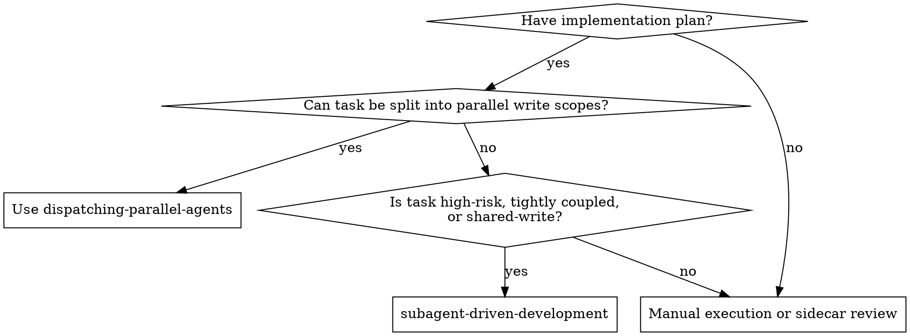
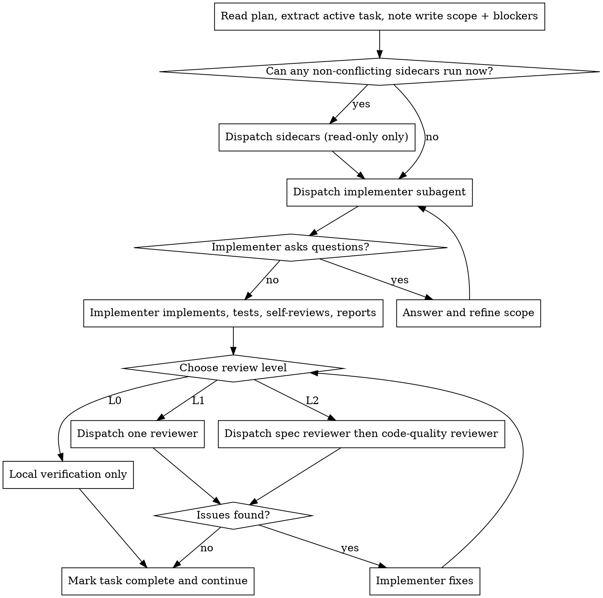

# Subagent-Driven Development

Execute a plan in the current session when the active task needs a **single coordinated writer**. This is the **high-assurance serial** workflow, not the default for all subagent work.

**Why subagents:** You delegate bounded work to specialized agents with isolated context. The controller keeps orchestration, task routing, and integration local.

**Core principle:** One writer for one write scope, optional read-only sidecars, review intensity matched to risk, and no silent mutation of the locked deliverable boundary.

## When to Use



**Use when:**
- Current task touches shared or overlapping write scopes
- Later steps depend on the exact output of the current task
- The change is high-risk: auth, payments, persistence, concurrency, migrations, core framework glue
- You want one writer, but still want sidecar help for review, exploration, or verification

**Don't use when:**
- Tasks can be split into 2-4 independent write scopes
- You mainly need parallel investigation across unrelated domains
- The task is small enough for direct execution plus one lightweight review

## Expected Inputs from writing-plans

When this skill executes a task from `superpowers:writing-plans`, the controller should carry forward:
- `Depends on`
- `Write Scope`
- `Potential Conflicts`
- `Verify`
- `Execution Recommendation`
- `Review Level`

If the upstream brief/spec/plan already locked any of these, carry them forward explicitly:
- deliverable shape
- primary user
- entry surface
- success criteria
- non-equivalent downgrade warnings

Do not reconstruct these from memory if the plan already provides them.

## Controller Rules

1. **Route before delegating.** If tasks can be split safely, use `superpowers:dispatching-parallel-agents` instead.
2. **One writer per write scope.** Shared write scope means one implementer, not zero parallelism.
3. **Shared write scope != waiting.** Keep read-only sidecars available:
   - explorer: find impacted call sites / dependencies
   - verifier: run tests that don't depend on the pending patch
   - reviewer: inspect a bounded diff or checklist
   - read-only sidecars may analyze and recommend, but may not create, modify, or delete files
4. **Do not spawn and immediately wait.** After dispatching any subagent, finish all non-blocking controller work before calling `wait_agent`.
5. **Review intensity follows risk.** Do not default every task to spec review plus code-quality review.
6. **Do not silently downgrade delivery shape.** If the task is supposed to ship a feature/page/panel/entry, neither controller nor implementer may quietly shrink it into CLI/tooling/internal-only work.

## Review Levels

Choose the lowest level that matches risk.

### L0 — Self-review only
Use for:
- Mechanical edits in 1-2 files
- Clear acceptance criteria
- Low-risk changes with obvious verification

Flow:
- implementer does work
- implementer self-reviews and reports
- controller verifies locally

### L1 — Single external review
Use for:
- Normal feature or bugfix tasks
- Medium-risk changes
- Tasks where one focused review is enough

Flow:
- implementer does work
- choose **one**: spec review **or** code-quality review
- fix issues if needed

### L2 — Two-stage review
Use for:
- High-risk or ambiguous tasks
- Core-path refactors
- Cross-module behavior changes where “built the right thing” and “built it well” are both non-trivial

Flow:
- implementer does work
- spec compliance review
- code-quality review
- fix / re-review only for failing stage

## The Process



## Model Selection

Use the least powerful model that can safely handle the task.

- Mechanical, well-scoped edits → cheap / fast model
- Multi-file implementation with integration concerns → standard model
- High-risk reasoning or review → strongest available model

## Handling Implementer Status

Implementer subagents report one of four statuses.

**DONE:** Proceed to local verification or external review based on review level.

**DONE_WITH_CONCERNS:** Read concerns first. If they affect correctness, address them before review.

**NEEDS_CONTEXT:** Provide missing context and re-dispatch.

**BLOCKED:** Decide whether to:
1. provide more context
2. reduce the write scope
3. swap to a stronger model
4. escalate to the human

Do not force repeated retries without changing anything.

## Prompt Templates

- `./implementer-prompt.md` - bounded writer prompt
- `./spec-reviewer-prompt.md` - bounded spec compliance review
- `./code-quality-reviewer-prompt.md` - bounded quality review

All prompts should make two things explicit when relevant:
- whether the subagent is a writer or read-only sidecar
- which delivery boundary may not be silently changed

## Example Workflow

```
You: I’m using Subagent-Driven Development because Task 3 changes the same patching file and cannot be split into separate write scopes.

[Extract Task 3 text, write scope, blockers, acceptance checklist]
[Dispatch one implementer]
[Dispatch one explorer to trace call sites for the same anchor]
[Run one non-blocking test locally]

Implementer:
  - Implemented compatibility fix
  - Ran targeted tests
  - Status: DONE_WITH_CONCERNS
  - Concern: same file still has one legacy summary path

Explorer:
  - Found second anchor path in rescan summary branch

You:
  - Fold concern + explorer result into follow-up instructions
  - Re-dispatch same implementer

Implementer:
  - Patched second branch
  - Targeted tests pass
  - Status: DONE

[Risk = medium, choose L1 spec review]
Reviewer: ✅ Matches checklist, no extra scope

[Run local regression]
[Mark task complete]
```

## Advantages

- Keeps a single writer on shared write scopes
- Preserves parallelism through read-only sidecars
- Reduces unnecessary review loops on low-risk tasks
- Keeps controller active instead of blocking immediately

## Red Flags

**Never:**
- Use this skill just because the user said “use subagents”
- Use this skill for tasks that clearly split into independent write scopes
- Spawn a subagent and immediately wait without checking for controller work or sidecars
- Dispatch multiple writer subagents into the same write scope
- Default every task to L2 review
- Move review scope beyond the relevant diff / checklist
- Move to the next task while required review issues are still open
- Let a read-only sidecar “helpfully” write docs / logs / notes
- Let an implementer quietly convert a user-facing deliverable into a smaller internal tool

**If subagent asks questions:**
- Answer clearly
- Narrow the write scope if needed
- Re-dispatch with updated context

**If reviewer finds issues:**
- Fix only the actual issues
- Re-run only the required review level
- Do not automatically repeat both reviews unless risk justifies it

**If delivery shape looks wrong during execution:**
- stop
- compare current work against the locked boundary
- either restore the intended shape or escalate before proceeding

## Integration

**Required workflow skills:**
- **superpowers:using-git-worktrees** - set up isolated workspace before starting
- **superpowers:writing-plans** - creates the plan this skill executes
- **superpowers:finishing-a-development-branch** - completes the work after implementation

**Related skills:**
- **superpowers:dispatching-parallel-agents** - use first when write scopes can be split
- **superpowers:requesting-code-review** - use for bounded reviewer prompts
- **superpowers:test-driven-development** - implementers should follow TDD when practical
